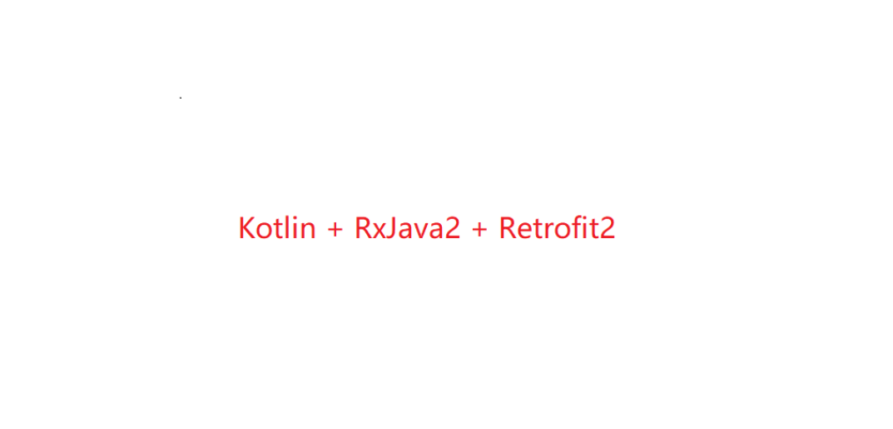
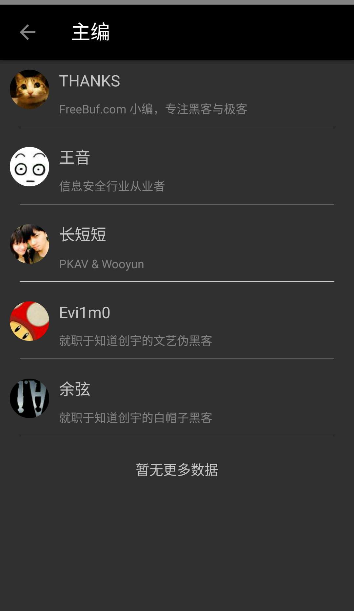
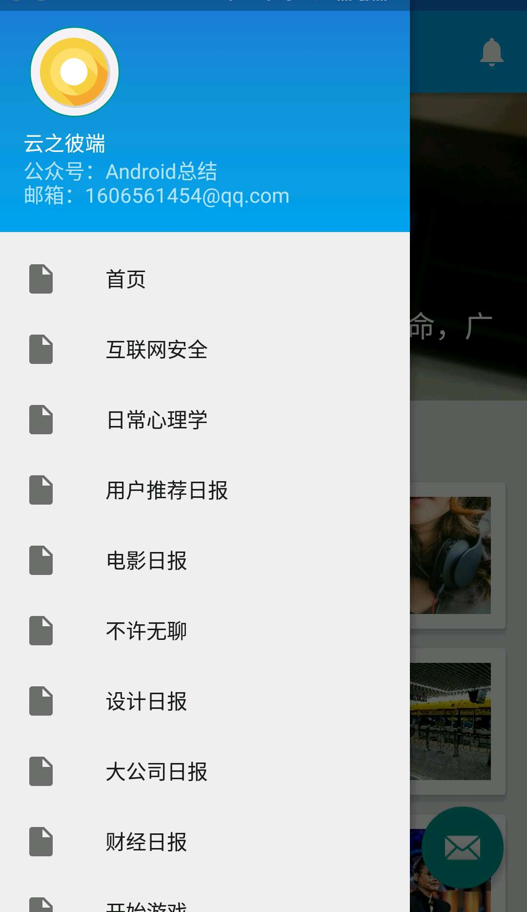

### 项目介绍

#### 前言

>此项目是基于Kotlin，RxJava2和Retrofit2开发的一个完全模仿于知乎日报的app，鉴于最近刚好学了kotlin语言，此项目用于练手。
其中api的地址来源于 https://github.com/izzyleung/ZhihuDailyPurify/wiki/%E7%9F%A5%E4%B9%8E%E6%97%A5%E6%8A%A5-API-%E5%88%86%E6%9E%90 。
对于刚好学了kotin，在使用rxjava和retrofit相结合的情况下，代码确实很多坑，好在在自己的不懈努力下基本上完成了该项目，该项目的用时也不是很长，只用了三天多的时间。
在项目期间还是了解了很多的知识。

#### 项目整体搭建

>项目添加的部分依赖如下：

        //Design
        implementation 'com.android.support:design:26.1.0'
        //CardView
        implementation 'com.android.support:cardview-v7:26.1.0'
        //RxJava
        implementation 'io.reactivex.rxjava2:rxjava:2.1.3'
        implementation 'io.reactivex.rxjava2:rxandroid:2.0.1'
        //RxBinding
        implementation 'com.jakewharton.rxbinding2:rxbinding:2.0.0'
        //rxrelay
        implementation 'com.jakewharton.rxrelay2:rxrelay:2.0.0'
        //circleimageview
        implementation 'de.hdodenhof:circleimageview:2.1.0'
        //retrofit and okhttp
        implementation 'com.squareup.retrofit2:retrofit:2.3.0'
        implementation 'com.squareup.retrofit2:adapter-rxjava2:2.3.0'
        implementation 'com.squareup.retrofit2:converter-gson:2.3.0'
        implementation 'com.squareup.okhttp3:okhttp-urlconnection:3.8.0'
        implementation 'com.squareup.okhttp3:logging-interceptor:3.8.0'
        implementation 'com.squareup.okhttp3:okhttp:3.9.0'
        //rxlifecycle
        implementation 'com.trello.rxlifecycle2:rxlifecycle:2.2.1'
        implementation 'com.trello.rxlifecycle2:rxlifecycle-components:2.2.1'

> 其中retrofit网络封装如下：

        private constructor() {
            var logging = HttpLoggingInterceptor(object : Logger{
                override fun log(message: String?) {
                }
            })
            logging.setLevel(HttpLoggingInterceptor.Level.BODY)
            mCookieManager = CookieManager()
            mCookieManager.setCookiePolicy(CookiePolicy.ACCEPT_ALL)
            mOkHttpClient = OkHttpClient.Builder()
                    .addInterceptor(logging)
                    .connectTimeout(20, SECONDS)
                    .cookieJar(JavaNetCookieJar(mCookieManager))
                    .build()
            var url = "http://news-at.zhihu.com/api/4/"
            mRetrofit = Retrofit.Builder()
                    .baseUrl(url)
                    .addConverterFactory(GsonConverterFactory.create())
                    .addCallAdapterFactory(RxJava2CallAdapterFactory.create())
                    .client(mOkHttpClient)
                    .build()
            api = mRetrofit.create(Api::class.java)
        }

>部分API如下：

        @GET("news/latest")
        fun latestNews(): Observable<Response<LatestNews>>

        @GET("news/before/{time}")
        fun beforeNews(@Path("time") time : String): Observable<Response<LatestNews>>

        @GET("theme/{item}")
        fun otherNews(@Path("item") item : String): Observable<Response<InternetNews>>

>因为接口比较少，功能比较少。只是简洁的封装了一次，没有对response的结果进行处理，如果在自己的项目里面一定要对其response进行处理。便于修改和处理问题。

其中在activity中调用入如下：

       HttpClient.getInstance()
                .service()
                .getSection(String.format("%d", section!!.id), time)
                .compose(SchedulerTransformer<Response<LisSections>>())
                .compose(DataTransformer<LisSections>())
                .observeOn(AndroidSchedulers.mainThread())

部分界面效果如下：

 

 

 

#### 总结

>首先做这个项目是受于我朋友的启发。早在之前就学习了kotlin，但是都仅限于学习学习语法，写写小demo等，并没有实际运用于项目之中，
最开始想着公司如果有机会的话自己就大展身手的使用，毕竟是google官方支持的语言。然而苦于公司并没有如此的机会，自己也就这样抛在
一边并没有管，就在前几天和朋友聊天谈论到kotlin，朋友就建议我写个小的项目试试，我就在网上找了部分的关于知乎日报的API接口。鉴于
此就完全按照知乎日报的界面进行绘制，功能的添加。历时三天的时间终于完成了（此处只针对部分GET请求，POST请求在该项目没有添加，因为涉
及到数据侵权问题，此处没有添加。但是基本的功能都是有）。完成时间比较短暂，因为时间有限，后期还会转到MVP模式。所以我打算也把源码公
开，如果有网友感兴趣的话也可以提提意见，后期会在项目里面完善。

APK下载地址：http://fir.im/yn4r

源码存放于百度云上面的。此处为百度云下载地址：链接：https://pan.baidu.com/s/1gfbAHgf 密码：nqgw。

>欢迎大家关注我的公众号：Android总结